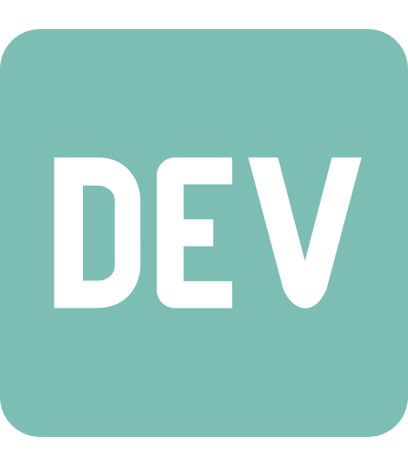

### Hi, I'm Hugo 🐱‍💻.

---

I am a full-stack software developer, engineer, and craftsman from Puebla, Mexico. I have been developing software professionally since 2009 and some years before that as a hobby. Lately, I've been specializing in web development, but I also like to be involved in both game development and game design.

Feel free to look at my [repositories](https://github.com/bul-ikana?tab=repositories) to see the random stuff I may be currently working on. You can also take a look at my [portfolio](posts/portfolio.md) to see some highlights.

---

	
	&nbsp;&nbsp;&nbsp;&nbsp;
	
	&nbsp;&nbsp;&nbsp;&nbsp;
	
	&nbsp;&nbsp;&nbsp;&nbsp;
	

